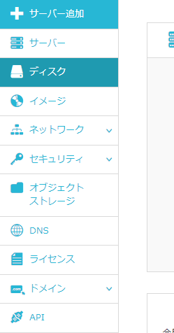
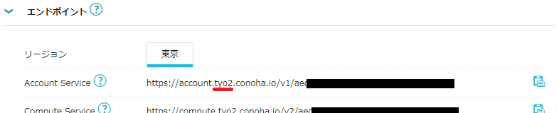
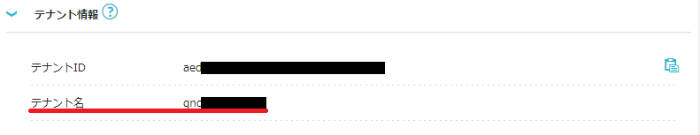
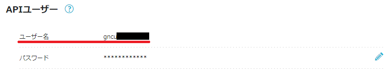

## ConohaChatOps
ConohaChatOps is an application made to manage conoha vps from discord.  
**ConohaChatOps**は[Conoha VPS](ttps://www.conoha.jp/)をDiscord上から管理するために作られたアプリケーションです。

## Requirement
Go1.16 or later

## 環境変数の取得方法

1. BOTTOKEN

  
[Discord Developer Portalを参考に](https://discord.com/developers/docs/getting-started)アプリケーションを作成後、左メニューの 「Bot」 > TOKENをコピーで取得

2. GUILDID

  
特定のサーバのみで稼働させたい場合にのみ指定するオプション項目です。  
[discordのサポートページを参考に](https://support.discord.com/hc/ja/articles/206346498)デベロッパモードを有効化後、Botを稼働させたいサーバーを右クリック >「IDをコピー」 で取得

3. Conoha_ENDPOINT

  
左メニューの「API」を選択

「エンドポイント」をクリックして表示されるURLからエンドポイントのリージョンを取得

4. Conoha_TENANTID

  
「API」画面内の「テナント情報」をクリックしてテナントIDを取得

5. Conoha_TENANTNAME

  
「API」画面内の「テナント情報」をクリックしてテナント名を取得

6. Conoha_USERNAME

  
[Conohaの利用ガイドを参考に](https://support.conoha.jp/v/addapiuser/)APIユーザを追加後、ユーザ名を取得

7. Conoha_PASSWORD

  
6の作業で作成したAPIユーザのパスワードを取得

## ローカルでBotを稼働する場合

## HerokuでBotを稼働する場合
