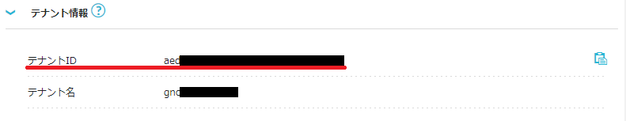

## ConohaChatOps
ConohaChatOps is an application made to manage conoha vps from discord.  
**ConohaChatOps**は[Conoha VPS](ttps://www.conoha.jp/)をDiscord上から管理するために作られたアプリケーションです。

## Requirement
Go1.16 or later

## 使い方
以下、[Conoha](https://www.conoha.jp/)にアカウント登録済みであることを前提に話を進めています。

Conohaコントロールパネルから「サーバー追加」を選択し、以下に従って設定してください．
* サービス : VPSを選択
* VPS割引きっぷ : 利用しない
* プラン : お好きなプランを選択
  > ※ 後ほどDiscordのコマンドからVPSを建てる際にプランを上書きする為、設定に苦労せず、値段のかからないプラン(1GBなど)を選択した方が良いです．
* イメージタイプ : お好きなイメージを選択
  > ※ 「アプリケーション」 > 「Minecraft Java版」のような作成済みのアプリケーションテンプレートを使っても良いですが、  
  > ファイアウォールの操作や仮想メモリの設定は必要最低限(或いはされていない)為、こだわりがある人は自分で最初からセットアップした方が良いです。
* rootパスワード : お好きなパスワードを入力
  > ※ この項目はConohaChatOpsから参照することはありません。
* ネームタグ : 「ConohaChatOps」と入力

ここまでの操作で，以下の画面のようになっていれば、画面右から「追加」を選択します。


そして，VMを一度手動で立ち上げた後はDiscordを通してVMを操作することになります。  
Botを常駐化する手法はいくつか存在しますが、ここでは以下の2つを紹介します．
* [ローカルでBotを稼働する場合](#ローカルでBotを稼働する場合)
* [HerokuでBotを稼働する場合](#HerokuでBotを稼働する場合)

### ローカルでBotを稼働する場合
1. 本リポジトリをローカルに持ってくる
```sh
$ git clone https://github.com/TOGEP/ConohaChatOps
$ cd ConohaChatOps
```

2. [環境変数の取得方法](#環境変数の取得方法)を参考に各種変数を.envファイルに書き込む

```sh
$ vi .env
```

```ini
BOTTOKEN=
GUILDID=
CONOHA_ENDPOINT=
CONOHA_TENANTID=
CONOHA_TENANTNAME=
CONOHA_USERNAME=
CONOHA_PASSWORD=
```

3. 実行
```sh
$ go run main.go
```

### HerokuでBotを稼働する場合
1. 本リポジトリをForkする

2. [HerokuとGithubを連携させて自動デプロイ環境を作ろう！](https://j-hack.gitbooks.io/deploy-meteor-app-to-heroku/content/step4.html)を参考にデプロイ環境を構築

3. [環境変数の取得方法](#環境変数の取得方法)を参考にして「Settings」 > 「Config Vars」を以下のように設定


4. 「Settings」 > 「Buildpacks」 > 「Add buildpack」 から`heroku/go`を指定

5. 右上の「View logs」から起動を確認!

#### 環境変数の取得方法

<details>
<summary>1. BOTTOKEN</summary>
  
[Discord Developer Portalを参考に](https://discord.com/developers/docs/getting-started)アプリケーションを作成後、左メニューの 「Bot」 > TOKENをコピーで取得
</details>

<details>
<summary>2. GUILDID</summary>
  
特定のサーバのみで稼働させたい場合にのみ指定するオプション項目です。  
[discordのサポートページを参考に](https://support.discord.com/hc/ja/articles/206346498)デベロッパモードを有効化後、Botを稼働させたいサーバーを右クリック >「IDをコピー」 で取得
</details>

<details>
<summary>3. Conoha_ENDPOINT</summary>
  
左メニューの「API」を選択


「エンドポイント」をクリックして表示されるURLからエンドポイントのリージョンを取得


</details>

<details>
<summary>4. Conoha_TENANTID</summary>
  
「API」画面内の「テナント情報」をクリックしてテナントIDを取得


</details>

<details>
<summary>5. Conoha_TENANTNAME</summary>
  
「API」画面内の「テナント情報」をクリックしてテナント名を取得


</details>

<details>
<summary>6. Conoha_USERNAME</summary>
  
[Conohaの利用ガイドを参考に](https://support.conoha.jp/v/addapiuser/)APIユーザを追加後、ユーザ名を取得


</details>

<details>
<summary>7. Conoha_PASSWORD</summary>
  
6の作業で作成したAPIユーザのパスワードを取得
</details>
